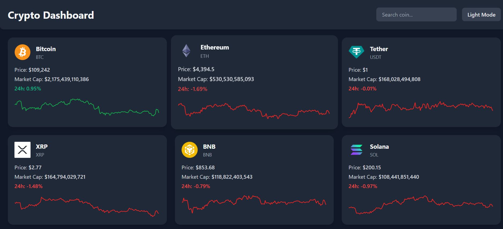
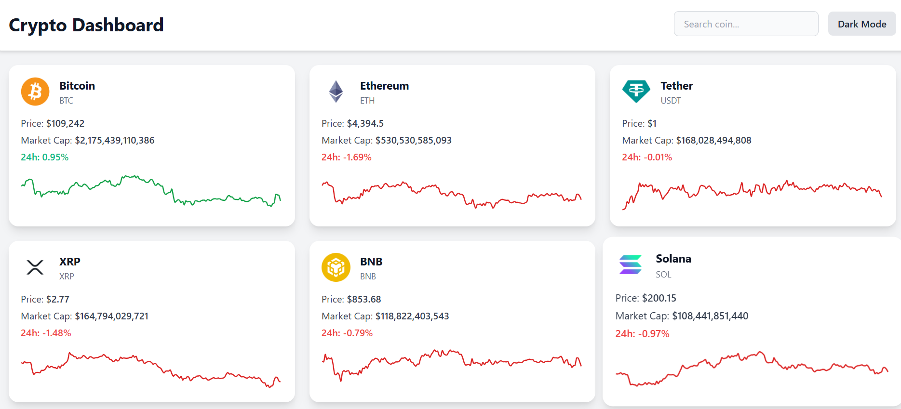

Crypto Dashboard Tracker

A fully responsive cryptocurrency dashboard tracker built with React and Tailwind CSS, allowing users to monitor real-time crypto prices, market caps, and historical trends with interactive charts.

Features

Realtime Cryptocurrency Prices – Track top 20 coins by market cap.

Mini Sparkline Charts – Each coin card shows a 7-day mini chart.

Interactive Historical Charts – Select a coin to view detailed 7-day price chart.

Search Functionality – Filter coins by name.

Dark Mode Support – Toggle between light and dark themes.

Responsive Design – Optimized for desktop, tablet, and mobile screens.

Modern Layout – Smooth animations and card-based design with Framer Motion.

Tech Stack

Frontend: React (Functional Components + Hooks)

Styling: Tailwind CSS

Charts: Chart.js via react-chartjs-2

Animations: Framer Motion

API: CoinGecko (no authentication required)

Deployment: Vercel / Netlify / Firebase Hosting

Other: Axios for API requests

Project Setup

Clone the repository:

git clone https://github.com/KimemiaT/crypto-dashboard.git
cd crypto-dashboard

Install dependencies:

``npm install

Run the development server:

npm run dev``
